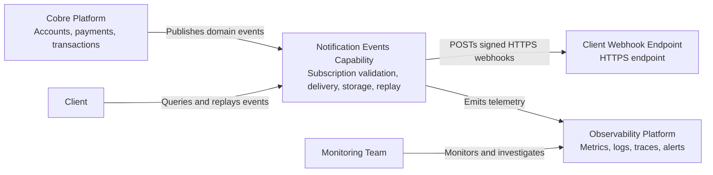
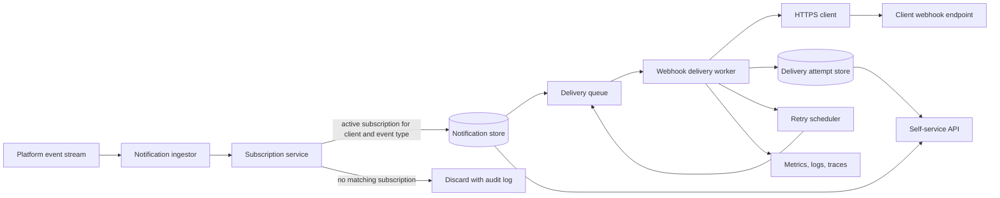
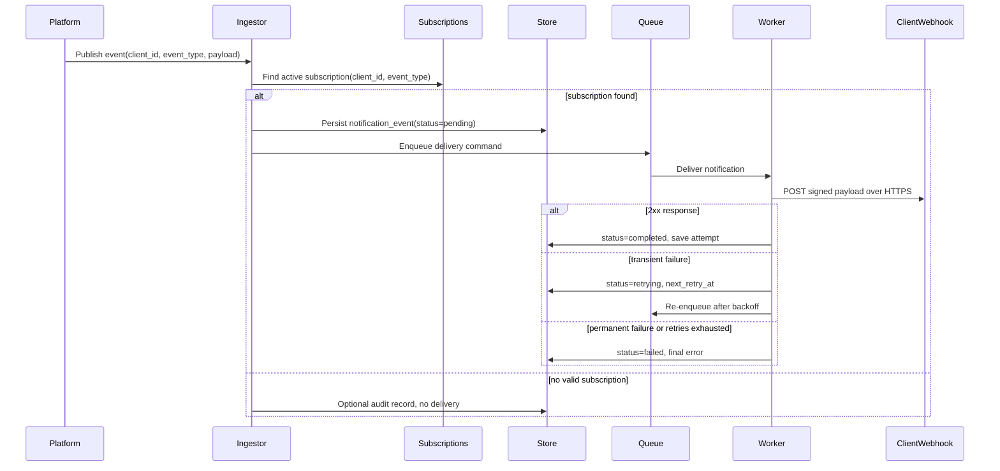

# System Design

## Goals

- Deliver platform-generated event notifications to each client's subscribed webhook endpoint.
- Ensure notifications are delivered only for events owned by the same client.
- Persist final delivery state and attempt history.
- Retry transient failures efficiently without overloading clients or Cobre infrastructure.
- Provide near real-time visibility for support and monitoring teams.
- Expose a self-service API for clients to query and replay failed notifications.

## Architecture

## Core Components

- **Notification ingestor** consumes platform events from a durable broker topic. It extracts `event_id`, `event_type`, `client_id`, creation time, and payload.
- **Subscription service** checks whether the client has an active subscription for the event type and returns the configured HTTPS endpoint and signing secret.
- **Notification store** persists the notification event, current delivery status, endpoint snapshot, attempt counters, timestamps, and final error details.
- **Delivery queue** decouples ingestion from webhook calls and absorbs bursts.
- **Delivery workers** send signed HTTPS POST requests with strict timeouts, bounded payload size, idempotency keys, and retry classification.
- **Retry scheduler** re-enqueues transient failures with exponential backoff and jitter.
- **Self-service API** exposes tenant-scoped query, detail, and replay operations.
- **Observability pipeline** emits metrics, logs, and traces for operations and support workflows.

## Data Model

Minimum persistent fields:

| Entity | Fields |
| --- | --- |
| `subscription` | `subscription_id`, `client_id`, `event_type`, `webhook_url`, `signing_secret_ref`, `status`, `created_at`, `updated_at` |
| `notification_event` | `notification_event_id`, `source_event_id`, `client_id`, `event_type`, `payload`, `created_at`, `delivery_status`, `endpoint_snapshot`, `attempt_count`, `last_attempt_at`, `next_retry_at`, `finalized_at`, `final_error_code`, `final_error_message` |
| `delivery_attempt` | `attempt_id`, `notification_event_id`, `attempt_number`, `started_at`, `finished_at`, `http_status`, `result`, `error_code`, `latency_ms`, `response_excerpt_hash` |

`delivery_status` values:

- `pending`: event is accepted and waiting for delivery.
- `in_progress`: a worker is actively delivering it.
- `completed`: endpoint returned a successful response.
- `retrying`: transient failure occurred and another attempt is scheduled.
- `failed`: max attempts were exhausted or a permanent failure occurred.

## Delivery Flow

## Retry Strategy

- Use at-least-once delivery with idempotency headers: `X-Cobre-Event-Id`, `X-Cobre-Notification-Id`, and `X-Cobre-Delivery-Attempt`.
- Retry transient conditions: connection timeout, read timeout, DNS failure, `429`, and `5xx`.
- Do not retry permanent conditions by default: invalid URL configuration, blocked egress policy, TLS validation failure, `400`, `401`, `403`, `404`, and `410`.
- Apply exponential backoff with jitter, for example: 1 minute, 5 minutes, 15 minutes, 1 hour, 6 hours.
- Cap attempts, for example 5 automatic attempts plus manual replay.
- Use dead-letter handling for poison messages and operational inspection.
- Snapshot the endpoint URL at event creation so delivery history is explainable even if the subscription changes later.

## Replay Behavior

Replay is a client-requested delivery for a terminal `failed` notification event. The replay operation:

- Verifies the event belongs to the authenticated client.
- Verifies the current state is `failed`.
- Creates a new delivery attempt or replay job linked to the original notification.
- Uses the current active subscription endpoint unless product policy requires using the original endpoint snapshot.
- Does not mutate the original payload.
- Emits audit logs and metrics for replay requests and replay outcomes.

## Observability

Near real-time monitoring should include:

- Metrics: accepted events, skipped events, delivery success rate, failure rate by client and event type, retry queue depth, attempts per notification, delivery latency, webhook timeout count, replay requests, dead-letter count.
- Logs: structured JSON with `notification_event_id`, `source_event_id`, `client_id`, `event_type`, `attempt_number`, `delivery_status`, `http_status`, and correlation IDs. Avoid logging full sensitive payloads.
- Traces: distributed trace from platform event ingestion to delivery attempt and API replay request.
- Dashboards: global health, per-client delivery health, retry backlog, failure classification, p95/p99 delivery latency.
- Alerts: sudden drop in success rate, growing retry backlog, repeated failures for a single high-volume client, dead-letter events, and elevated API authorization failures.

## Scalability And Resiliency Decisions

- Asynchronous delivery prevents client webhook latency from impacting the core platform transaction path.
- Durable broker and persistent state allow recovery after worker restarts.
- Partitioning by `client_id` or notification ID supports horizontal scaling while preserving useful ordering where needed.
- Worker concurrency and per-client rate limits prevent one failing endpoint from consuming all delivery capacity.
- Circuit breakers reduce load against consistently failing client endpoints.
- Idempotency keys let clients safely handle duplicate deliveries from retries or worker recovery.
