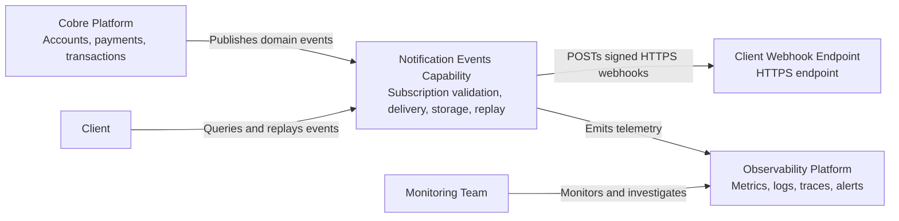
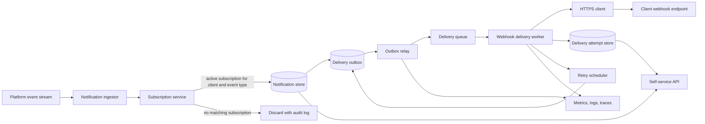
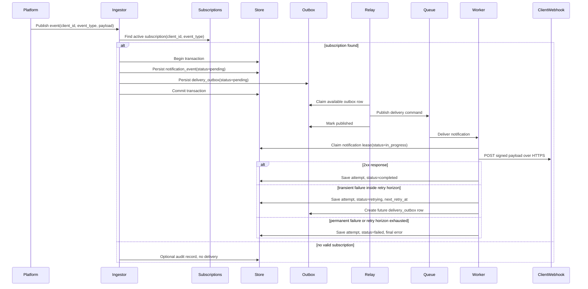

# System Design

## Goals

- Deliver platform-generated event notifications to each client's subscribed webhook endpoint.
- Ensure notifications are delivered only for events owned by the same client.
- Persist final delivery state and attempt history.
- Prevent accepted notifications from being lost between persistence and queue publication.
- Retry transient failures efficiently without overloading clients or Cobre infrastructure.
- Provide near real-time visibility for support and monitoring teams.
- Expose a self-service API for clients to query and replay failed notifications.

## Architecture

The repository implementation is a local assessment slice: fixture-backed storage, header-based tenant identity, synchronous replay processing, and a real HTTP webhook adapter with bounded retries. The diagrams below describe the production architecture I would propose at Cobre scale.

## Core Components

- **Notification ingestor** consumes platform events from a durable broker topic. It extracts `source_event_id`, `event_type`, `client_id`, creation time, and payload.
- **Subscription service** checks whether the client has one active subscription for the event type and returns the configured HTTPS endpoint and signing secret reference.
- **Notification store** persists notification events, encrypted payload references or encrypted payloads, current delivery status, attempt counters, timestamps, and final error details.
- **Transactional outbox** stores delivery jobs in the same database transaction as the notification event so accepted notifications always have recoverable work.
- **Outbox relay** publishes available outbox rows to the delivery queue and marks rows as published. It emits alerts for stale unpublished rows.
- **Delivery queue** decouples ingestion from webhook calls and absorbs bursts.
- **Delivery workers** claim work with leases, send signed HTTPS POST requests with strict timeouts and bounded payload size, classify outcomes, and persist attempts.
- **Retry scheduler** creates future outbox work for transient failures using exponential backoff and jitter.
- **Replay service** creates separate replay jobs for terminal failed notifications without mutating the original failure history.
- **Self-service API** exposes tenant-scoped query, detail, and replay operations.
- **Observability pipeline** emits metrics, logs, and traces for operations and support workflows.

## Data Model

Minimum persistent fields:

| Entity | Fields |
| --- | --- |
| `subscription` | `subscription_id`, `client_id`, `event_type`, `webhook_url`, `signing_secret_ref`, `status`, `created_at`, `updated_at` |
| `notification_event` | `notification_event_id`, `source_event_id`, `client_id`, `event_type`, `payload_ref` or encrypted `payload`, `payload_hash`, `created_at`, `delivery_status`, `attempt_count`, `last_attempt_at`, `next_retry_at`, `finalized_at`, `final_error_code`, `final_error_message`, `lock_version`, `leased_by`, `lease_expires_at`, `current_attempt_id` |
| `delivery_attempt` | `attempt_id`, `notification_event_id`, `delivery_execution_id`, `attempt_number`, `started_at`, `finished_at`, `http_status`, `result`, `error_code`, `latency_ms`, `response_excerpt_hash`, `endpoint_snapshot` |
| `replay_job` | `replay_id`, `notification_event_id`, `client_id`, `idempotency_key`, `request_hash`, `replay_status`, `requested_at`, `started_at`, `finished_at`, `requested_by`, `endpoint_snapshot`, `final_error_code` |
| `delivery_outbox` | `outbox_id`, `notification_event_id`, `delivery_execution_id`, `job_type`, `status`, `available_at`, `published_at`, `attempt_count`, `last_error`, `created_at` |
| `idempotency_key` | `client_id`, `idempotency_key`, `request_hash`, `response_body`, `status_code`, `created_at`, `expires_at` |

Important constraints and indexes:

- Unique active `subscription` per `(client_id, event_type)`.
- Unique `notification_event(source_event_id, client_id, event_type)` for duplicate source-event suppression.
- Unique `delivery_attempt(notification_event_id, delivery_execution_id, attempt_number)`.
- Unique `replay_job(client_id, idempotency_key)` while the idempotency record is retained.
- Unique `idempotency_key(client_id, idempotency_key)` while retained.
- Index `notification_event(client_id, created_at DESC, notification_event_id DESC)`.
- Index `notification_event(client_id, delivery_status, created_at DESC)`.
- Index `replay_job(notification_event_id, created_at DESC)`.
- Index `delivery_outbox(status, available_at)`.

## Delivery State Machine

`delivery_status` values:

- `pending`: event is accepted and waiting for delivery.
- `in_progress`: a worker lease is active.
- `retrying`: a transient failure occurred and another automatic attempt is scheduled.
- `completed`: endpoint returned a successful response.
- `failed`: max retry horizon was reached or a permanent failure occurred.

Legal delivery transitions:

- `pending -> in_progress -> completed`
- `pending -> in_progress -> retrying -> pending`
- `pending -> in_progress -> failed`
- Expired `in_progress` leases return to `pending` or `retrying` through a recovery job.

Replay has a separate state machine so a failed original delivery remains auditable:

- `pending -> in_progress -> completed`
- `pending -> in_progress -> failed`

Worker concurrency rules:

- Workers claim jobs with optimistic locking using `lock_version`.
- Claimed rows set `leased_by`, `lease_expires_at`, and `current_attempt_id`.
- State updates include the expected `lock_version` to prevent stale workers from overwriting newer state.
- A worker crash after sending a webhook may cause a duplicate delivery, but cannot corrupt terminal state.
- A recovery job scans expired leases and returns recoverable work to the queue.

## Delivery Flow

The notification event and first outbox row are persisted atomically. If the ingestor crashes after commit, the outbox relay can still publish the delivery command later.

## Retry Strategy

- Use at-least-once delivery. Clients must handle duplicate and out-of-order webhooks.
- Include `X-Cobre-Event-Id`, `X-Cobre-Notification-Id`, and `X-Cobre-Delivery-Attempt` on every webhook.
- Attempt first delivery as soon as possible after event acceptance.
- Retry transient conditions for up to three days with exponential backoff and jitter.
- Suggested backoff: about 1 minute, 5 minutes, 30 minutes, 2 hours, then progressively spaced attempts until the three-day horizon is reached.
- Retry transient conditions: connection timeout, read timeout, DNS failure, `429`, and `5xx`.
- Do not retry permanent conditions by default: invalid URL configuration, blocked egress policy, TLS validation failure, `400`, `401`, `403`, `404`, and `410`.
- Use dead-letter handling for poison messages and operational inspection.
- Snapshot the endpoint URL and signing secret reference for each delivery execution so history is explainable even if the subscription changes later.

## Replay Behavior

Replay is a client-requested delivery for a terminal `failed` notification event. Replay creates a separate `replay_job` and delivery execution linked to the original notification.

Replay behavior:

- Verifies the event belongs to the authenticated client.
- Verifies the current delivery status is `failed`.
- Requires `Idempotency-Key`.
- Returns the same replay response for the same `(client_id, idempotency_key, request_hash)`.
- Returns `409` if the same client reuses an idempotency key with a different request body.
- Uses the current active subscription endpoint so clients can fix a broken webhook before replaying.
- Snapshots the endpoint and signing secret reference used by each replay execution.
- Does not mutate the original payload or original terminal delivery status.
- Emits audit logs and metrics for replay requests and replay outcomes.

## Subscription Model

Version 1 uses the simplest useful subscription model:

- One active endpoint per `(client_id, event_type)`.
- `https://` webhook URLs only.
- Subscription fields include `webhook_url`, `signing_secret_ref`, `status`, `event_type`, and timestamps.
- Subscription lookup happens when a notification is created.
- Endpoint snapshots are stored for delivery executions and replay executions.

Future enhancements can add multiple endpoints per client, per-endpoint filters, overlapping signing-secret rotation windows, endpoint health status, and automatic pause policies.

## Event Ordering

Version 1 does not guarantee ordering. Clients must handle duplicate and out-of-order webhook deliveries.

The system preserves enough metadata to add narrower ordering later if business semantics require it:

- Partition by `(client_id, aggregate_id)` for event types that need per-account or per-transaction ordering.
- Add sequence numbers per aggregate if the platform event stream can provide them.

Avoiding a v1 ordering guarantee keeps worker parallelism high and prevents one failing webhook from blocking unrelated events.

## Observability

Near real-time monitoring should include:

- Metrics: accepted events, skipped events, delivery success rate, global failure rate, retry queue depth, attempts per notification, delivery latency, webhook timeout count, replay requests, dead-letter count, and stale unpublished outbox rows.
- Logs: structured JSON with `notification_event_id`, `source_event_id`, `client_id`, `event_type`, `attempt_number`, `delivery_status`, `http_status`, `outbox_id`, `replay_id`, and correlation IDs.
- Traces: distributed trace from platform event ingestion to outbox relay, delivery attempt, and API replay request.
- Dashboards: global health, curated top-N client delivery health, retry backlog, failure classification, p95/p99 delivery latency, and outbox relay lag.
- Alerts: sudden drop in success rate, growing retry backlog, repeated failures for a high-volume client, dead-letter events, stale outbox rows, replay spikes, and elevated API authorization failures.

Avoid raw `client_id` as a high-cardinality metric label in broad metrics. Keep `client_id` in structured logs and traces, and expose per-client health through log queries or curated top-N metrics.

## Scalability And Resiliency Decisions

- Start with one relational database, normalized tables, deliberate indexes, and retention controls.
- Do not partition or shard the initial assessment design; about 100k events per day is well within a single relational database when indexed properly.
- Asynchronous delivery prevents client webhook latency from impacting the core platform transaction path.
- Durable broker, transactional outbox, and persistent state allow recovery after process restarts.
- Worker concurrency and per-client rate limits prevent one failing endpoint from consuming all delivery capacity.
- Circuit breakers reduce load against consistently failing client endpoints.
- Idempotency keys and notification IDs let clients safely handle duplicate deliveries from retries or worker recovery.

Future growth path:

1. Add read replicas for self-service query traffic.
2. Move old raw payloads to cold or object storage while retaining searchable metadata.
3. Isolate high-volume clients into separate queues or worker pools.
4. Partition notification tables by month when retention and maintenance require it.
5. Consider sharding only when a single database can no longer meet measured write, read, or maintenance requirements.

## Local Docker Compose Topology

The current repository is locally runnable with Maven only. A production-like local topology could add Docker Compose with:

- API service for self-service query and replay endpoints.
- Worker service for webhook delivery.
- Outbox relay service for publishing pending outbox rows.
- PostgreSQL for notification state, attempts, replay jobs, idempotency, and outbox rows.
- Queue broker, such as RabbitMQ or Redis Streams.
- Mock webhook receiver for local delivery testing.
- Optional OpenTelemetry collector plus local logs for observability demonstration.

For this assessment submission, the implemented local path loads `notification_events.json`, exposes the self-service API, and sends replay webhooks to the configured `cobre.webhook.url`.

## Out Of Scope For The Assessment

Test, staging, and production deployment topology are intentionally out of scope. The design remains compatible with future managed database backups, point-in-time recovery, cross-zone replication, durable managed brokers, and defined RPO/RTO targets when business requirements are known.
